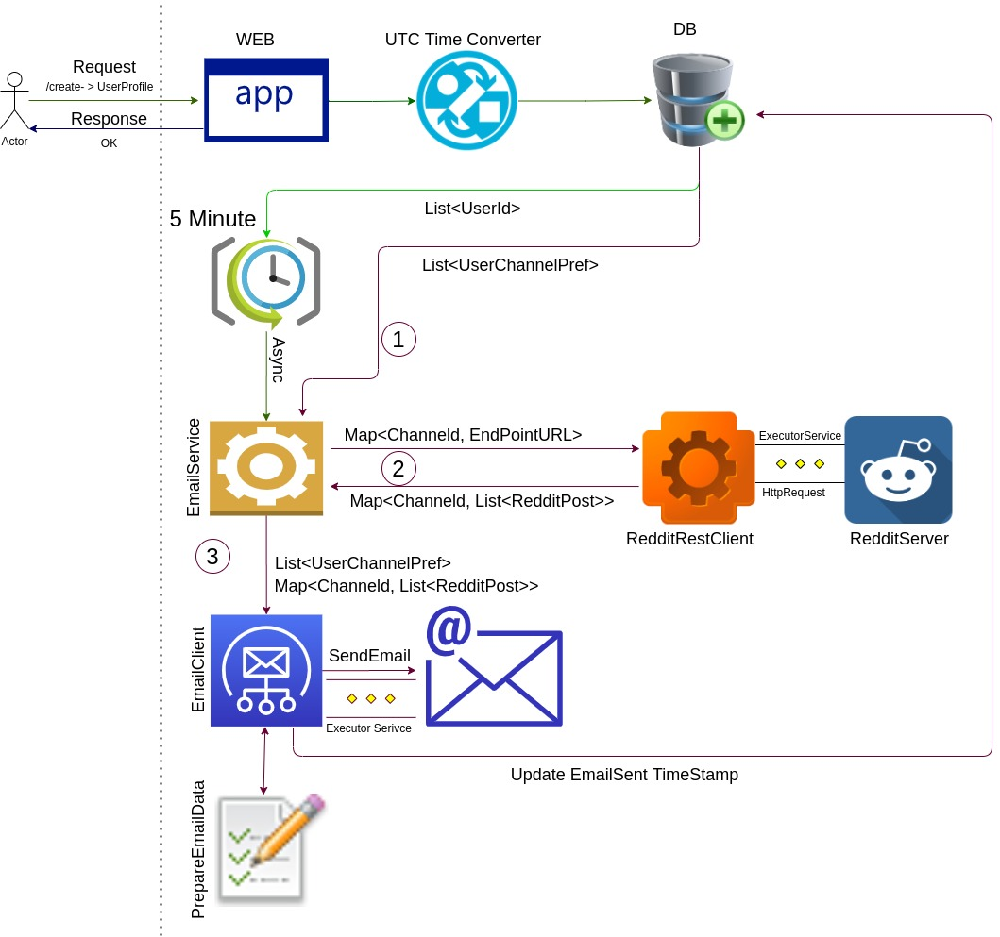
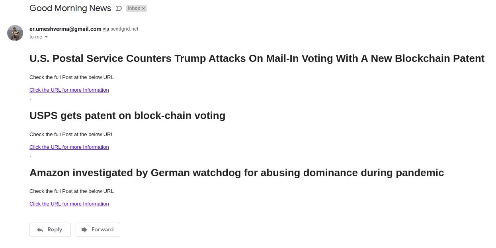

# notification
Send Reddit Notification to subscribed User

# High Level Design of Application

 

# User recieve below Email 


# Resources 
# User Api

- Create User Account 
- URL
```URL
http://localhost:8081/api/user/create/
```
- PUTRequest
```json
{
	"fullName":"Umesh Verma",
	"emailId":"TestEmail@gmail.com",
	"countryCode": "DE",
	"notificationStatus": "SUBSCRIBED"
}
```

# *****************************User API ******************************

# Add User profile 
- GETRequest with Path Param {emailId}
- URL
```URL
http://localhost:8081/api/user/fetch/{emailId}
```
- Response Format : Please Note UserId is essential for further API call
```json
{
    "userId": "dd178821-15c6-45c2-9b97-7df4d1ce73d1",
    "emailId": "TestEmail@gmail.com",
    "notificationStatus": "SUBSCRIBED"
}
```

# Enable Subscription for USER by default it is enabled
- URL 
```URL
http://localhost:8081/api/user/enableSubscription
```
- PUTRequest
```json
{ 
    "userId": "8b065a35-b305-49e9-b601-2e7ecbe84f4f"
}
```

# Disable Subscription for USER
- URL 
```URL
http://localhost:8081/api/user/disableSubscription
```
- PUTRequest
```json
{ 
    "userId": "8b065a35-b305-49e9-b601-2e7ecbe84f4f"
}
```

# ***************************** Subscription API for USER: ******************************

# Add channels to subscribe for notification by default the notification enabled. Use user API to disable.

- URL 
```URL
http://localhost:8081/api/subscribe/addChannel
```
- PUTRequest
```json
{
    "userId": "dd178821-15c6-45c2-9b97-7df4d1ce73d1",
    "redditChannel": "technology"
}
```

# Update user channel: 
- This API removes all the old subscribed channels and Add new updated channel.

- URL 
```URL
http://localhost:8081/api/subscribe/updateChannel
```
- PUTRequest
```json
{
    "userId": "dd178821-15c6-45c2-9b97-7df4d1ce73d1",
    "redditChannel": "technology"
}
```

# ***************************** Email Notification  ******************************

# send Email notification to user at any time.
- This API will send the email to list of user provided they have notification enabled and have valid channel subscribed. 

- URL 
```URL
http://localhost:8081/api/email/send
```
- PUTRequest
```json
  [
    "dd178821-15c6-45c2-9b97-7df4d1ce73d1",
    "8b065a35-b305-49e9-b601-2e7ecbe84f4f",
    "97095a32-h602-47b2-l205-6h0ecke24j4j"
    ]
    
```

# Assumption
- User always sending correct Channel names during Adding channel No validation done